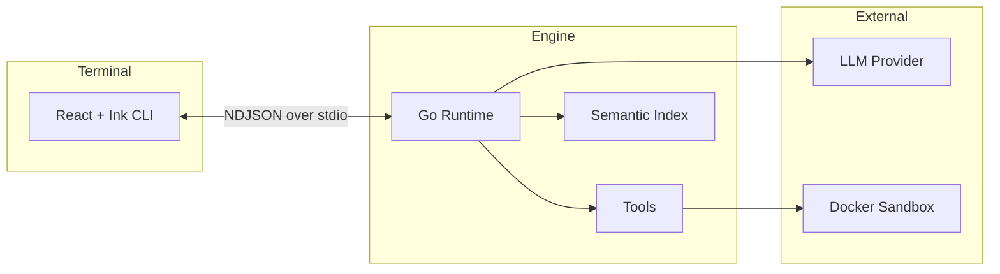

# Dodo

An open-source AI coding agent built in Go.

Dodo helps you build, refactor, and understand codebases through natural language. It combines LLM reasoning with tools for code manipulation, semantic search, and sandboxed execution—all running locally on your machine.

## Why Dodo?

| | Dodo | Claude Code | Gemini CLI |
|:--|:--|:--|:--|
| **License** | MIT (Open Source) | Proprietary | Proprietary |
| **Command Execution** | Docker sandboxed | Local host | Cloud-based |
| **LLM Support** | Any (OpenAI, Claude, Gemini, local) | Anthropic only | Google only |
| **Architecture** | Go backend + React terminal UI | Closed | Closed |

**Built differently:**
- Written in pure Go by a single developer—no heavy agent frameworks
- Your code stays on your machine
- Simple enough to understand, fork, and extend
- Commands run in Docker containers, not directly on your host

## Features

- **Agentic workflow**: Planning, tool use, and iterative problem-solving
- **Semantic search**: Vector-based codebase indexing for intelligent code discovery
- **Code editing**: Search-replace and file manipulation with full diffs
- **Sandboxed execution**: Commands run in isolated Docker containers
- **Multi-provider**: Works with OpenAI, Anthropic, Google, or local models
- **Terminal UI**: React-based interface with real-time streaming
- **Session persistence**: Pick up where you left off
- **Cancellation**: Press ESC to stop any task

## Architecture



The engine handles all agent logic: planning, tool orchestration, and LLM communication. The CLI is a thin React/Ink layer that renders the conversation and streams events in real-time. They communicate over stdin/stdout using line-delimited JSON.

### Engine (Go)

- **Coder Agent** (`internal/coder`): High-level planning and execution
- **Tool System** (`internal/tools`): File operations, search, editing, command execution
- **Indexer** (`internal/indexer`): Vector embeddings with SQLite storage
- **Sandbox** (`internal/sandbox`): Docker-based isolated command execution
- **Providers** (`internal/providers`): OpenAI, Anthropic, Google, and custom endpoints

### CLI (React + Ink)

- Real-time activity stream showing tool calls and reasoning
- Inline code diffs for file changes
- Collapsible conversation turns
- Keyboard navigation and input

## Quick Start

### Prerequisites

- **Go 1.21+**: For building the engine
- **Node.js 18+**: For the Ink CLI
- **LLM API Key**: OpenAI API key or other provider
- **Docker** (optional, recommended): For secure command execution sandboxing

### 1. Build the Engine

```bash
# Clone and enter the project
cd dodo

# Build the engine binary
go build -o repl ./cmd/repl
```

### 2. Set Up Environment

Create a `.env` file in the project root:

```bash
# Required: Your LLM API key
OPENAI_API_KEY=sk-your-api-key-here

# Optional: Choose LLM provider (default: openai)
LLM_PROVIDER=openai

# Optional: Model selection (default: gpt-4)
OPENAI_MODEL=gpt-4o

# Optional: Docker sandbox configuration (recommended for security)
DODO_SANDBOX_MODE=auto
```

### 3. Run the CLI

```bash
# Install dependencies
cd ink-ui
npm install

# Run the CLI (replace path with your target repo)
npm run dev -- --repo /path/to/your/project --engine ../repl
```

**Example**:
```bash
npm run dev -- --repo ../../my-web-app --engine ../repl
```

### 4. Alternative: REPL Mode

For quick interactive sessions without the UI:

```bash
./repl --repo /path/to/your/project
```

Type your task and press Enter. The agent will plan and execute.

## Usage Examples

### Web Development
```
you> Build a REST API endpoint for user registration with email validation
```

### Refactoring
```
you> Refactor the authentication module to use dependency injection
```

### Bug Fixing
```
you> Fix the memory leak in the worker pool implementation
```

### Code Understanding
```
you> Explain how the routing system works and find all route definitions
```

## How It Works

### The Coder Agent Workflow

1. **Planning Phase**: Agent creates a structured plan using the `plan` tool
   - Breaks down complex tasks into steps
   - Identifies required files and operations
   - Estimates complexity
   - Planning is enforced for non-trivial tasks

2. **Execution Phase**: Agent executes the plan step by step
   - Reads relevant code using `read_file`, `grep`, `codebase_search`
   - Uses `code_beacon` for deep codebase investigation when needed
   - Makes edits with `search_replace` or `write` (only after planning)
   - Runs tests with `run_cmd`, `run_build`, or `run_tests` (sandboxed in Docker)

3. **Streaming**: All operations stream in real-time
   - Reasoning thoughts
   - Tool invocations with metadata
   - Code changes with diffs
   - Results and summaries

### Tool Orchestration

The agent has access to multiple tools and chooses the best approach:

- **Discovery**: `codebase_search` → `read_file` → `code_beacon` (if needed)
- **Editing**: `read_span` → plan edits → `search_replace`
- **Validation**: `run_cmd`, `run_build`, or `run_tests` to run tests or checks (executed in Docker containers for security)
- **Iteration**: Responds to errors and tries alternative approaches

### Semantic Indexing

Dodo indexes your codebase on first run:

1. **File Discovery**: Walks the repo, respects `.gitignore`
2. **Chunking**: Splits files into semantic chunks (functions, classes)
3. **Embedding**: Generates vector embeddings via OpenAI
4. **Storage**: Persists in SQLite with vector similarity support
5. **Freshness**: Incremental updates on file changes

Index stored in `.dodo/index.db` in your repo.

## CLI Features

### Activity Stream

See exactly what the agent is doing:

```
🧠 reasoning (active)
📖 read_file main.go (120 lines) ✓
🔍 grep "func.*Handler" (src/) ✓
✏️ search_replace server.go (L45-52) ✓

📝 server.go (L45-52)
- func StartServer() {
+ func StartServer(port int) {
+   log.Printf("Starting on port %d", port)
```

### Collapsible Turns

Keep conversations organized:

```
━━━━━━━━━━━━━━━━━━━━━━━━━━━━━━━━━━━━━━━━━
👤 User: Add error handling to the API

🤖 Assistant: I've added comprehensive error handling... (collapsed)
   4 activities · Press Enter to expand
━━━━━━━━━━━━━━━━━━━━━━━━━━━━━━━━━━━━━━━━━
👤 User: Now add tests
```

### Real-time Feedback

Watch the agent think:

```
Status: thinking  🧠
Current: Analyzing the codebase structure...
```

## Configuration

### Environment Variables

#### LLM Configuration

| Variable | Description | Default | Required |
|----------|-------------|---------|----------|
| `OPENAI_API_KEY` | OpenAI API key | - | Yes |
| `LLM_PROVIDER` | LLM provider name | `openai` | No |
| `OPENAI_MODEL` | Model to use | `gpt-4` | No |
| `OPENAI_BASE_URL` | Custom API endpoint | OpenAI default | No |

#### Docker Sandbox Configuration

Dodo uses Docker containers to securely execute commands (build, test, etc.) in isolation. When Docker is available, commands run in isolated containers with resource limits and security restrictions.

| Variable | Description | Default | Required |
|----------|-------------|---------|----------|
| `DODO_SANDBOX_MODE` | Sandbox execution mode: `docker` (force Docker), `host` (no isolation), or `auto` (Docker if available, fallback to host) | `auto` | No |
| `DODO_DOCKER_IMAGE` | Custom Docker image override. If not set, images are auto-selected: Go → `golang:alpine`, Node → `node:alpine`, Python → `python:alpine`, Rust → `rust:alpine` | Auto-detected | No |
| `DODO_DOCKER_CPU` | CPU limit for containers (e.g., `"2"`, `"1.5"`) | `"2"` | No |
| `DODO_DOCKER_MEMORY` | Memory limit for containers (e.g., `"1g"`, `"512m"`) | `"1g"` | No |

**Recommended Setup:**
```bash
# Use Docker sandboxing when available (recommended for security)
DODO_SANDBOX_MODE=auto
```

**Security Features:**
- Commands run in isolated containers with no network access
- Read-only root filesystem (except mounted repository)
- Non-root user execution (UID 1000)
- Dropped capabilities (no privilege escalation)
- Resource limits (CPU and memory)
- Automatic cleanup of containers after execution

**Note:** If Docker is unavailable, Dodo will automatically fall back to host execution with a warning. For production use, ensure Docker is installed and running.

### CLI Options

```bash
# Engine mode (for CLI)
./repl engine --stdio --repo /path/to/repo

# REPL mode (interactive)
./repl --repo /path/to/repo

# CLI with custom engine
npm run dev -- --repo /path/to/repo --engine /path/to/repl
```

## Project Structure

```
dodo/
├── cmd/
│   └── repl/
│       ├── main.go              # CLI entrypoint
│       └── stdio_runner.go      # NDJSON protocol handler
├── internal/
│   ├── coder/                   # Coder agent implementation
│   │   └── agent.go             # Main coding agent
│   ├── codebeacon/              # CodeBeacon analysis agent
│   │   ├── beacon_agent.go      # CodeBeacon agent
│   │   ├── beacon_tool.go       # code_beacon tool wrapper
│   │   └── report_parser.go    # Report parsing
│   ├── engine/                  # Core agent engine
│   │   ├── agent.go             # Agent engine core
│   │   ├── hooks.go            # Hook system
│   │   ├── state.go            # Agent state management
│   │   ├── step.go             # Step execution
│   │   ├── run.go              # Main execution loop
│   │   ├── protocol/           # NDJSON protocol definitions
│   │   │   └── protocol.go
│   │   └── ...
│   ├── tools/                   # Tool implementations
│   │   ├── editing/            # Code editing tools
│   │   │   ├── replace.go      # search_replace
│   │   │   └── write.go        # write
│   │   ├── execution/          # Command execution tools
│   │   │   ├── cmd.go          # run_cmd
│   │   │   ├── build.go        # run_build
│   │   │   ├── test.go         # run_tests
│   │   │   └── runner.go       # Sandbox runner interface
│   │   ├── filesystem/         # File operations
│   │   │   ├── read.go         # read_file
│   │   │   ├── list.go         # list_files
│   │   │   ├── write.go        # write_file
│   │   │   └── delete.go       # delete_file
│   │   ├── reasoning/          # Reasoning tools
│   │   │   ├── plan.go         # plan
│   │   │   ├── think.go         # think
│   │   │   └── respond.go      # respond
│   │   ├── search/             # Search tools
│   │   │   ├── grep.go         # grep
│   │   │   ├── semantic.go     # codebase_search
│   │   │   └── span.go         # read_span
│   │   └── registry.go         # Tool registry
│   ├── sandbox/                 # Command execution sandboxing
│   │   ├── docker.go           # Docker sandbox implementation
│   │   ├── host.go             # Host executor (no isolation)
│   │   ├── config.go           # Configuration
│   │   └── images.go           # Docker image management
│   ├── indexer/                 # Semantic indexing system
│   │   ├── indexer.go          # Main indexer
│   │   ├── chunker.go          # Code chunking
│   │   ├── embedder.go         # Vector embeddings
│   │   ├── search.go           # Search interface
│   │   └── ...
│   ├── providers/              # LLM provider implementations
│   │   ├── openai.go
│   │   ├── anthropic.go
│   │   └── factory.go
│   ├── factory/                # Agent factory
│   │   └── agent_factory.go   # BuildBrainAgent, etc.
│   └── prompts/                # System prompts
│       ├── interactive.go      # Interactive/coding prompt
│       ├── code_beacon.go      # CodeBeacon prompt
│       └── ...
├── ink-ui/                      # React + Ink CLI
│   ├── src/
│   │   ├── components/          # React components
│   │   │   ├── ActivityItem.tsx
│   │   │   ├── ActivityStream.tsx
│   │   │   ├── CodeDiff.tsx
│   │   │   ├── CollapsibleTurn.tsx
│   │   │   ├── Conversation.tsx
│   │   │   ├── Footer.tsx
│   │   │   └── Header.tsx
│   │   ├── hooks/               # Custom hooks
│   │   │   ├── useConversation.ts
│   │   │   └── useEngineEvents.ts
│   │   ├── ui/
│   │   │   └── app.tsx          # Main app component
│   │   ├── engineClient.ts      # NDJSON client
│   │   ├── protocol.ts          # Protocol types
│   │   ├── types.ts             # Shared types
│   │   └── index.tsx            # Entry point
│   ├── package.json
│   └── README.md                # CLI-specific docs
├── go.mod
├── go.sum
├── .env.example
└── README.md                    # This file
```

## Troubleshooting

### "Repository path does not exist"

**Fix**: Ensure the path exists and is a directory:
```bash
ls -la /path/to/your/repo
```

### "Engine binary not found"

**Fix**: Build the engine first:
```bash
cd dodo && go build -o repl ./cmd/repl
```

### "Engine closed before session became ready"

**Causes**:
- Missing `OPENAI_API_KEY` environment variable
- Invalid API key
- Network issues

**Fix**: Check your `.env` file:
```bash
cat .env
# Should contain: OPENAI_API_KEY=sk-...
```

### JSON Parsing Errors

**Cause**: Engine is printing non-NDJSON output to stdout.

**Fix**: Ensure you're using the latest version. All logs should go to stderr in `--stdio` mode.

### Indexing Takes Too Long

**Solution**: Indexing runs once. Subsequent starts use incremental updates. For very large repos (>10k files), initial indexing may take 5-10 minutes.

### Docker Sandbox Issues

**"Docker not available" warning:**
- **Cause**: Docker daemon is not running or Docker is not installed
- **Fix**: Install Docker and ensure the daemon is running:
  ```bash
  # Check if Docker is running
  docker ps
  
  # If not running, start Docker Desktop or Docker daemon
  ```

**"Failed to create Docker runner" warning:**
- **Cause**: Docker daemon is not accessible or permissions issue
- **Fix**: 
  ```bash
  # Verify Docker is accessible
  docker ps
  
  # Check Docker socket permissions (Linux)
  ls -la /var/run/docker.sock
  
  # Add user to docker group (Linux)
  sudo usermod -aG docker $USER
  ```

**Container creation failures:**
- **Cause**: Docker image pull failed or insufficient resources
- **Fix**: 
  ```bash
  # Manually pull the required image
  docker pull golang:alpine  # For Go projects
  docker pull node:alpine    # For Node projects
  docker pull python:alpine  # For Python projects
  docker pull rust:alpine    # For Rust projects
  ```

**Note**: If you prefer to disable Docker sandboxing (not recommended for production), set `DODO_SANDBOX_MODE=host` in your `.env` file.

## Development

### Running Tests

```bash
# Run Go tests
go test ./...

# Run specific package tests
go test ./internal/indexer -v
```

### Building for Development

```bash
# Build engine
go build -o repl ./cmd/repl

# Build CLI in watch mode
cd ink-ui && npm run dev
```

### Debugging

**Engine logs** (stderr):
```bash
# Run engine with visible logs
./repl engine --stdio --repo /path/to/repo 2>engine.log
```

**CLI logs** (use browser DevTools):
```bash
# CLI errors go to terminal
npm run dev -- --repo /path/to/repo --engine ../repl
```

#### Debug Mode (AI-friendly structured logging)

Enable debug mode for structured JSON logging:

```bash
# Enable debug mode
export DODO_DEBUG=true
dodo-ui

# View structured debug logs
cat /tmp/dodo_debug.log | jq .
```

**Debug Commands:**
- `/debug` - Dumps current state to `/tmp/dodo_diagnostics.json`
- `/configure` - Open configuration wizard

**Debug log categories:**
- `event` - Backend events received
- `command` - Commands sent to backend
- `state` - State changes
- `lifecycle` - Component mount/unmount
- `error` - Errors with context

**Create a debug alias:**
```bash
echo 'alias dodo-ui-debug="export DODO_DEBUG=true && dodo-ui"' >> ~/.zshrc
source ~/.zshrc
```

## Contributing

Contributions are welcome! Areas of interest:

- **New Tools**: Add more specialized tools for different tasks
- **LLM Providers**: Support for more providers (Anthropic, local models)
- **UI Improvements**: Enhanced CLI features, themes, keyboard shortcuts
- **Performance**: Faster indexing, smarter chunking, better caching
- **Testing**: More comprehensive test coverage

### Adding a New Tool

1. Implement `engine.Tool` interface in the appropriate subdirectory (`internal/tools/editing/`, `execution/`, `filesystem/`, `reasoning/`, or `search/`)
2. Register in `internal/tools/registry.go` in `NewToolRegistry()`
3. Add prompt documentation in `internal/prompts/` if needed
4. Update protocol events in `cmd/repl/stdio_runner.go` if needed

### Adding a New LLM Provider

1. Implement `engine.LLMClient` interface in `internal/providers/`
2. Add provider detection in `internal/providers/factory.go`
3. Update `.env.example` with new provider config
4. Test streaming and tool calling

## Protocol Documentation

For detailed protocol specifications, see:
- `internal/engine/protocol/protocol.go` - Go definitions
- `ink-ui/src/protocol.ts` - TypeScript definitions
- `ink-ui/README.md` - CLI usage guide

## Design Principles

1. **Clean Separation**: Engine ↔ CLI communicate only via NDJSON
2. **Streaming First**: All operations stream for real-time feedback
3. **Tool Transparency**: User sees every tool call and result
4. **Plan Before Execute**: Agent must plan before making edits
5. **Type Safety**: Full TypeScript on frontend, strict types in Go
6. **Provider Agnostic**: Easy to swap LLM providers
7. **Testable**: Components are isolated and mockable

## Roadmap

### Near Term
- [x] Docker sandboxing for secure command execution
- [x] Support for Anthropic Claude API
- [ ] Configurable keyboard shortcuts in CLI
- [ ] Workspace-level configuration files
- [ ] Better error recovery and retry logic
- [x] Tool execution timeouts and cancellation

### Medium Term
- [ ] Multi-file edit transactions (atomic commits)
- [ ] Integration with version control (git)
- [ ] Custom tool plugins via WASM or subprocess
- [ ] Conversation export/import
- [ ] Local LLM support (Ollama, llama.cpp)

### Long Term
- [ ] Web UI alternative to terminal CLI
- [ ] Collaborative mode (multiple users, one agent)
- [ ] Agent memory and learning from feedback
- [ ] Code review and suggestion modes
- [ ] IDE extensions (VS Code, JetBrains)

## License

MIT License - see [LICENSE](LICENSE) for details.

## Acknowledgments

Built with:
- [Ink](https://github.com/vadimdemedes/ink) - React for CLIs
- [Cloudwego Eino](https://github.com/cloudwego/eino) - Agent framework

---

Built by [@chams](https://github.com/chamseddinebouzaiene). Contributions welcome.

## Troubleshooting and Learnings

### Debugging Input Issues (ESC Key Case Study)

**Symptom:** Backend was unresponsive to keyboard interrupts (ESC) during long-running tasks.
**Root Cause:** The backend's main input loop (`stdio_runner.go`) was processing commands synchronously. When a `UserMessageCommand` triggered a long-running agent execution, the loop blocked, preventing the `CancelRequestCommand` from being read from stdin until the task finished.
**Fix:** The command handler (`handleLine`) was moved to a goroutine to process commands asynchronously, allowing the input loop to remain responsive to new commands (like cancellation) at all times.

**Best Practices for Future Debugging:**
1. **Instrument Everything:** Verify data flow at every hop (Input -> Frontend -> Protocol -> Backend).
2. **Check for Blocking Loops:** In event-driven systems (like CLI tools), ensure the main event loop never blocks on long operations.

### Context Awareness Injection

**Feature:** When a task is cancelled, the agent is automatically informed on the next run.
**Mechanism:** 
1. `sessionState` tracks `lastRunCancelled` boolean.
2. `stdio_runner` sets this flag upon successful cancellation.
3. On the next `UserMessageCommand`, the runner prepends `[System Note: ...]` to the prompt if the flag is set.
4. The flag is reset immediately after consumption.
