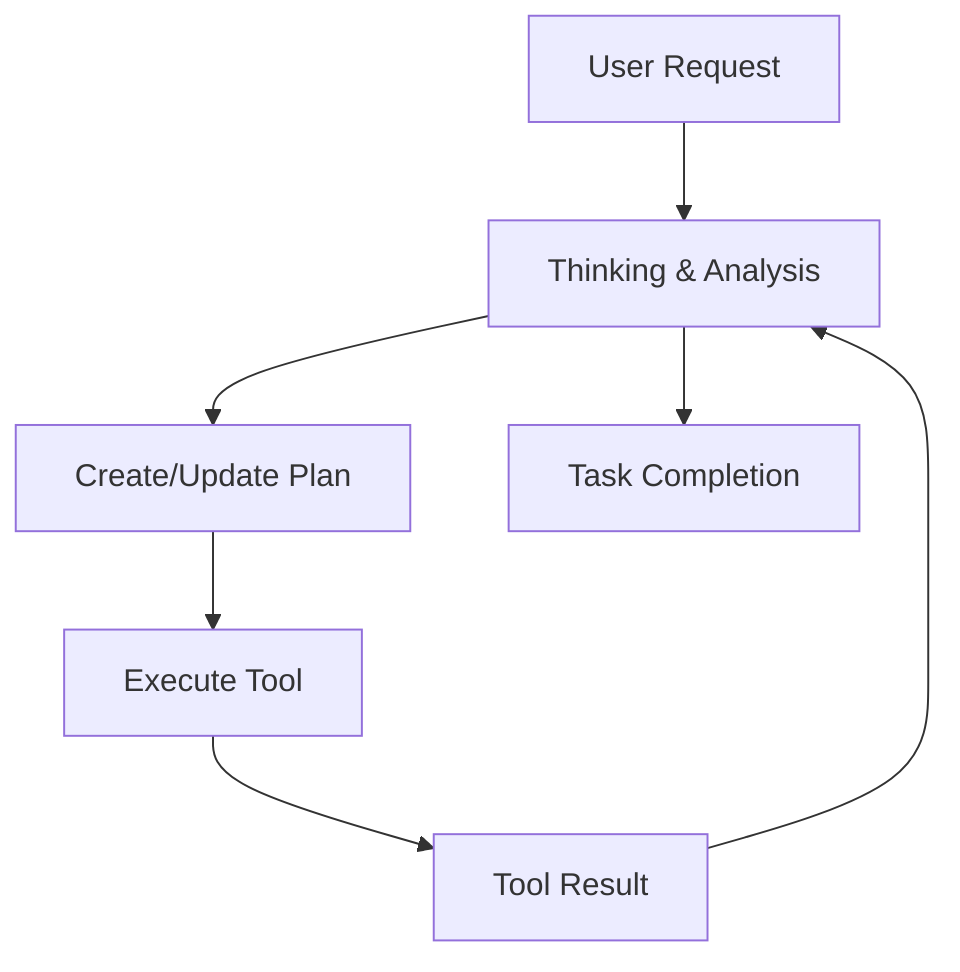

# The Agentic Workflow

Unlike autocomplete tools (like GitHub Copilot) that predict the next few lines of text, Dodo behaves like a **semi-autonomous developer**. It uses a structured loop of reasoning to solve large-scale problems.

## The Loop: Think → Plan → Act

When you give Dodo a task, it doesn't just start writing code. It follows a rigorous mental process:

### 1. Thinking (Reasoning)
Before touching any file, the agent analyzes the request. It asks:
- "Do I have enough context?"
- "What files are relevant?"
- "Is this risky?"

This internal monologue is streamed to you in real-time, so you know exactly *why* the agent is making a decision.

### 2. Planning
For complex tasks (like "Refactor this module"), Dodo creates a **structured plan**. 
- It breaks the goal into step-by-step milestones.
- It won't proceed to step 2 until step 1 is verified.
- **You are involved**: You can see the plan and (in future versions) edit it before execution.

### 3. Tool Execution
Dodo interacts with your computer using **Tools**. It cannot do anything "magic" outside of these defined capabilities:
- **`read_file`**: Read file contents.
- **`codebase_search`**: Find code semantic search.
- **`run_cmd`**: Execute terminal commands (tests, builds).
- **`replace_file_content`**: Edit code with surgical precision.

### 4. Verification
Crucially, Dodo **checks its work**. After editing a file, it might run the build command or the unit tests to ensure it didn't break anything. If verification fails, it self-corrects and tries again.

## Why this matters?

This workflow allows Dodo to handle tasks that require **long-term memory** and **multi-step reasoning**, such as:
- "Upgrade this dependency and fix all breaking changes."
- "Implement this feature across the backend and frontend."
- "Debug this error by adding logs, running the app, and reading the output."
