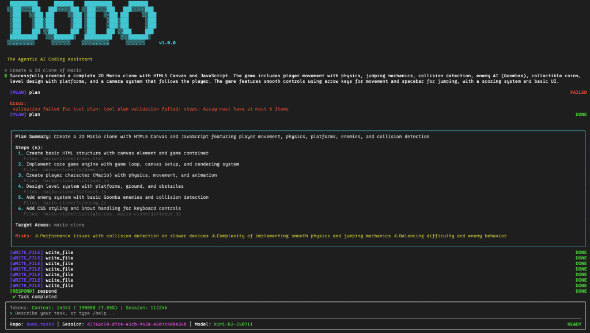
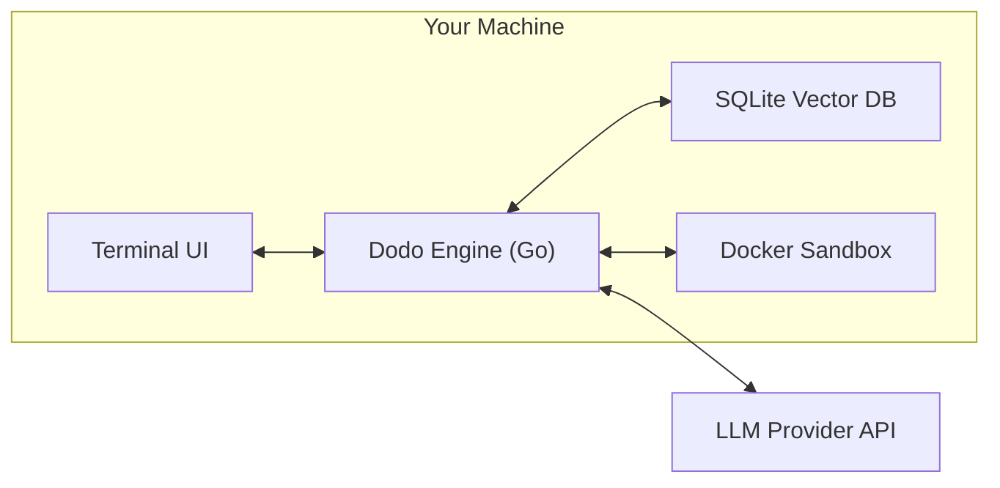

---
hide:
  - navigation
---

# Your AI Coding Partner, **On Your Terms.**

<div align="center">
  
  <p>
    <strong>Local-First • Sandboxed • Model-Agnostic</strong>
  </p>
  <p>
    Dodo is an open-source AI agent that lives in your terminal. It helps you build, refactor, and understand code without sending your IP to the cloud (unless you want to).
  </p>

  <p>
    <a class="md-button md-button--primary" href="getting-started/installation/">Get Started</a>
    <a class="md-button" href="https://github.com/ChamsBouzaiene/dodo">View on GitHub</a>
  </p>
</div>



---

## Why Dodo?

Most AI coding tools are either:
1.  **Closed Source SaaS**: You have no control over data privacy or internal logic.
2.  **IDE Plugins**: Great for autocomplete, but bad at "Big Picture" agentic tasks.

**Dodo is different.** It's a standalone agent engine that runs locally on your machine.

### ✨ Key Features

<div class="grid cards" markdown>

-   :material-shield-lock: **Sandboxed Execution**
    ---
    Every command runs in an isolated Docker container. Let the agent run tests or builds without fear of `rm -rf /`.

-   :material-brain: **Model Agnostic**
    ---
    Bring your own keys. Works with GPT-4o, Claude 3.5 Sonnet, Gemini Pro, or **Local Models** (Ollama/LM Studio).

-   :material-database-search: **Semantic Indexing**
    ---
    Dodo indexes your codebase into a local vector database, allowing it to "understand" project structure and find relevant files instantly.

-   :material-console: **Terminal Native**
    ---
    Built for developers who live in the CLI. Full keyboard control, beautiful TUI (Ink), and integrates with your existing workflow.

</div>

## How It Works



## Quick Start

Install via npm:

```bash
npm install -g dodo-ai
```

[Start Coding :material-arrow-right:](getting-started/installation.md){ .md-button .md-button--primary }
